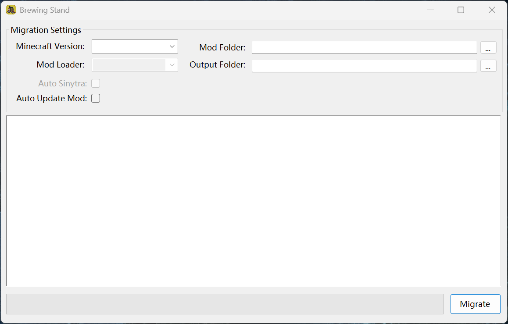

  
  <h1 style="font-size: 28px; margin: 10px 0;">Brewing Stand</h1>
  
Migrate between different loaders kind of easier I guess

  
  
  
   
    
    

# Description
Brewing Stand is a tool used for migrating between different mod loaders. It is hard to do this manually, especially for those big mod packs. With this tool, you can save a lot of effort migrating between mod loaders.

# Notes Before Use
> [!WARNING]
> Brewing Stand is not supposed to be an automation tool, it is supposed to save efforts and be a helper. You need to double check the result after migration, and you should think carefully before using Brewing Stand on your important instances and worlds. The actions cannot be undone, please backup your mods if necessary before use.

> [!NOTE]
> Brewing Stand works by grabbing mods **from Modrinth ONLY**, it is possible that the mod developer does not upload the mod onto modrinth, in this case, you need to manually download from Curseforge or other platforms.

# Start Migrating

To start migrating, the following fields are necessary:
- Minecraft Version
- Mod Loader
- Mod Folder

**Minecraft Version** automatically updates as you load the tool, it is normal for you to see an empty dropdown at the beginning, wait and retry.

As you have filled the **Minecraft Version** field, the **Mod Loader** field automatically unlocks.

**Mod Loader** field is the **target mod loader** you want to migrate to. Don't select the original mod loader.

> [!NOTE]
> Even though NeoForge split out from Forge in 1.20.1, in Brewing Stand, it is still considered as Forge since NeoForge in 1.20.1 has basically no difference with Forge.

**Auto Sinytra** Switch automatically downloads *Sinytra Connector, Forgified Fabric API, Connector Extras* after the migration is finished. The option is only available when the mod loader selected is **Forge** or **NeoForge**.

**Auto Update Mod** Switch will update mods to their latest version during migration. **Do not check the box if you are not certain for what you are doing**.

The **Mod Folder** field indicates where the `mods/` folder is. Input manually through the field or click the `...` button at the back.

The **Output Folder** field isn't necessary. If it is left empty, the mods will be output to the `{Mod Loader}_mods` in the parent folder of `mods/` folder, where `{Mod_Loader}` is the mod loader you've selected.

After all the necessary field are filled, click the **Migrate** button on the bottom right corner. You may experience a lag, that is normal. Then wait until the process is completed.

Open the output folder, you will find your migrated mods. You may also find `failedConversions.txt`, this is a list of those which had not been migrated successfully.

After cleanup of the migrated mods, you can now stuff the mods into your new instance and try. It is completely normal for the game to crash at first. It is not easy to migrate. If it crashed, then you need to fix these yourself, Brewing Stand can no longer help you.

___

  Contributions are welcome! <3 
  Made with ❤️ and C#. 
  The Project is under <a href="https://www.apache.org/licenses/LICENSE-2.0">Apache 2.0 License</a> .

